# in_tail benchmark results

## Environment

* Collector
  * CentOS 8 on AWS t2.medium instance
* Aggregator
  * CentOS 8 on AWS t2.medium instance

## Benchmark Scenario

* increase generating lines rate step by step
  * baseline(0 line/sec)
  * 500 messages/sec
  * 1000 messages/sec
  * 1500 messages/sec
* Generate syslog message with loggen

## Fluentd Configurations for benchmarking

### Collector configuration

```
in_syslog ------> out_forword -----> [aggregator node]
```


```aconf
<source>
  @type tail
  @log_level error
  path /var/log/messages
  tag raw.tail
  pos_file /var/log/td-agent/posfiles/varlog-messages.pos
  format none
</source>

<filter raw.tail>
  @type record_modifier
  <record>
    hostname "#{Socket.gethostname}"
    log_source varlog-messages
    os_resolver_grp srvunix
    host_env BENCHMARK
    application_name "Terraform Deployment on Azure"
    fluentd_utc_timestamp ${Time.at(time).getgm.to_s}
  </record>
</filter>

<match raw.tail>
  @type forward
  ignore_network_errors_at_startup true
  heartbeat_type tcp
  heartbeat_interval 10
  @log_level debug
  transport tls
  tls_cert_path /etc/ssl/certs/ca_cert.pem
  tls_verify_hostname false
  tls_allow_self_signed_cert true
  <server>
    host 10.2.3.4
    port 24224
  </server>
  <security>
    self_hostname "#{Socket.gethostname}"
    shared_key "shard_key"
  </security>
  <buffer>
    @type file_single
    path /var/log/td-agent/buffer/benchmarking-varlog-messages.buffer
    compress gzip
    flush_interval 5s
    overflow_action drop_oldest_chunk
  </buffer>
</match>
```

### Aggregator configuration

```
[collector node] ------> in_forword -----> out_stdout
```

```aconf
<source>
  @type forward
  <transport tls>
    ca_cert_path /etc/ssl/certs/ca_cert.pem
    ca_private_key_path /etc/ssl/certs/ca_key.pem
    ca_private_key_passphrase fluentd
  </transport>
  <security>
    shared_key "shard_key"
    self_hostname "#{Socket.gethostname}"
  </security>
</source>
<match **>
  @type stdout
</match>
```

## Results -- Boxplots

### Calyptia-Fluentd

#### CPU usage -- Supervisor

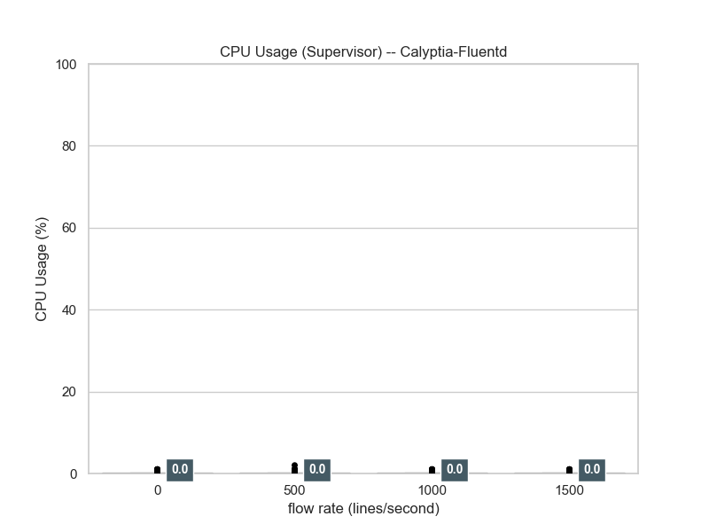

CPU usage of Fluentd supervisor is around zero.

#### CPU usage -- Worker

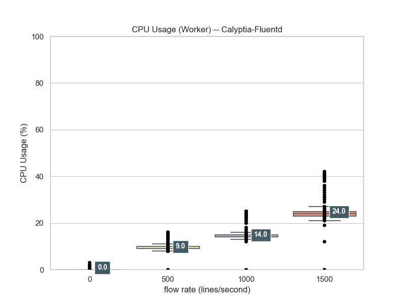

CPU usage of Fluentd worker corresponds to flow rate.
(This plot does not adjust with CPU counts.)

#### RSS usage -- Supervisor

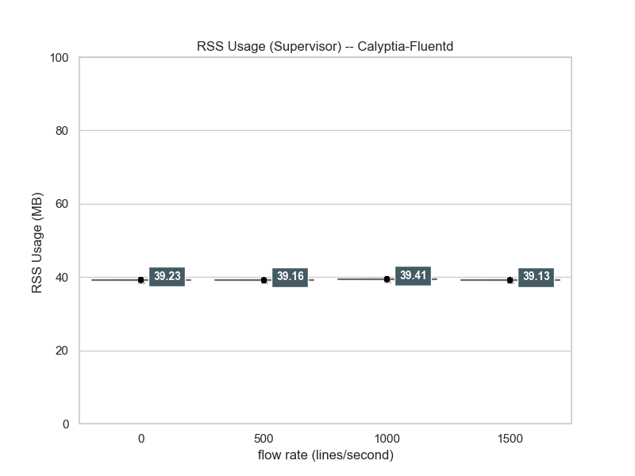

RSS usage of Fluentd supervisor is almost same.
This plot uses actual values of RSS.

#### RSS usage -- Worker

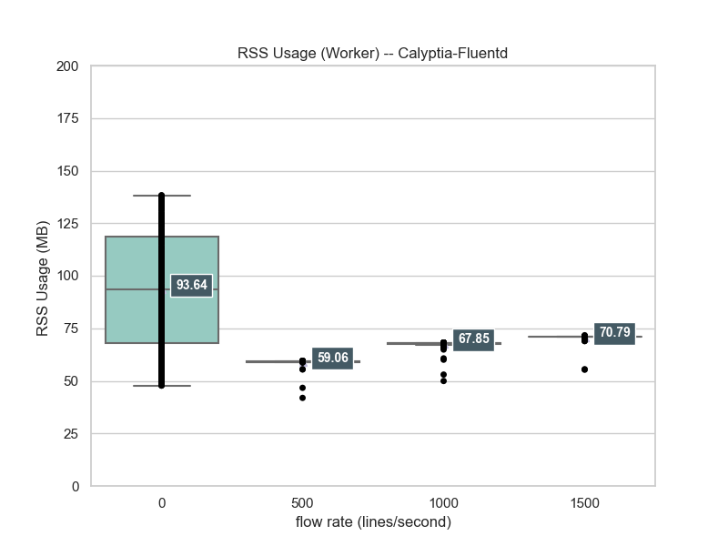

RSS usage of Fluentd worker weakly corresponds to flow rate.
This plot uses actual values of RSS.
baseline RSS usage is a bit of strange....

#### VMS usage -- Supervisor

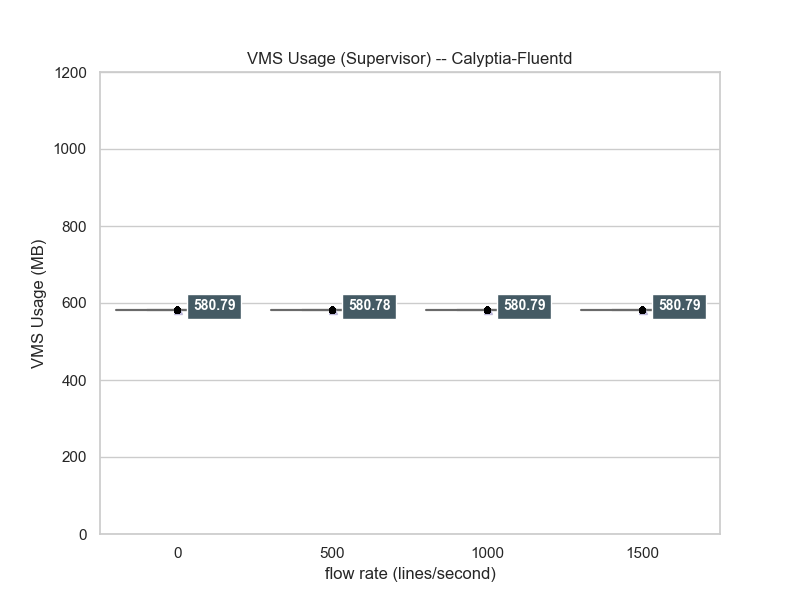

VMS usage of Fluentd supervisor is almost same.
This plot uses actual values of VMS.

#### VMS usage -- Worker

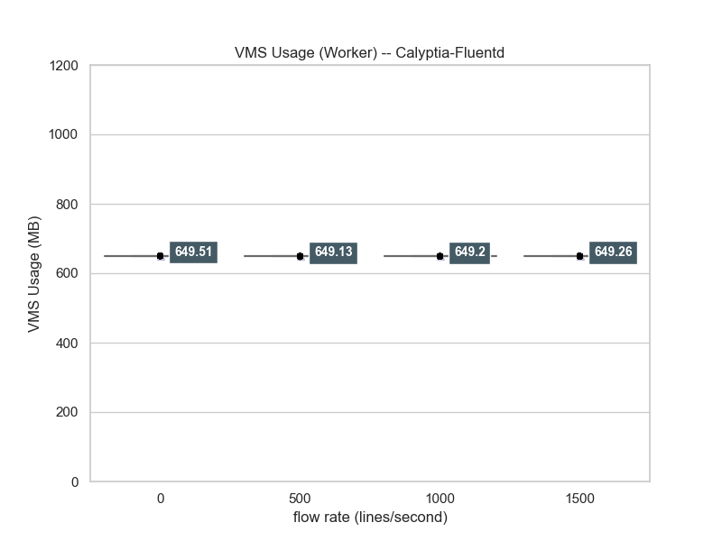

VMS usage of Fluentd supervisor is almost same.
This plot uses actual values of VMS.

### Td-Agent

#### CPU usage -- Supervisor


CPU usage of Fluentd supervisor is around zero.

#### CPU usage -- Worker

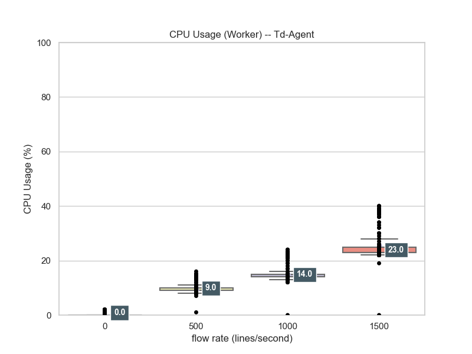

CPU usage of Fluentd worker corresponds to flow rate.
(This plot does not adjust with CPU counts.)

#### RSS usage -- Supervisor

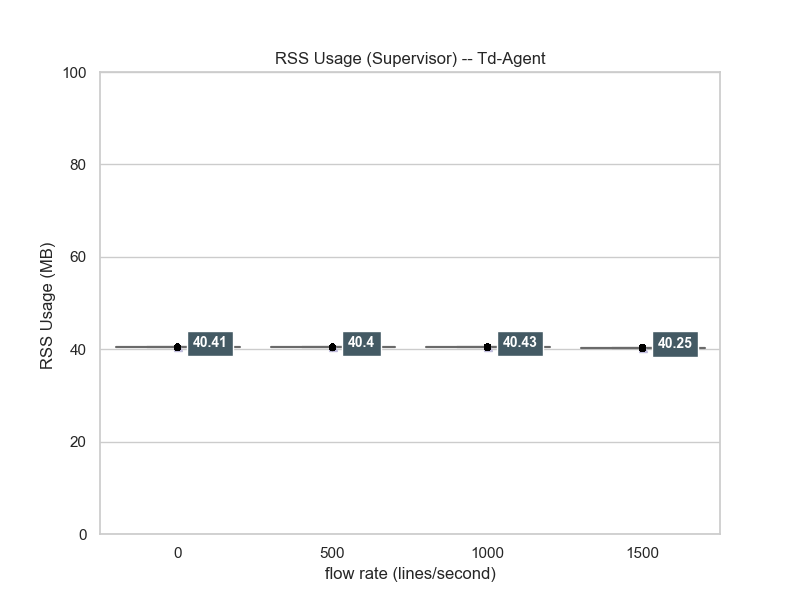

RSS usage of Fluentd supervisor is almost same.
This plot uses actual values of RSS.

#### RSS usage -- Worker

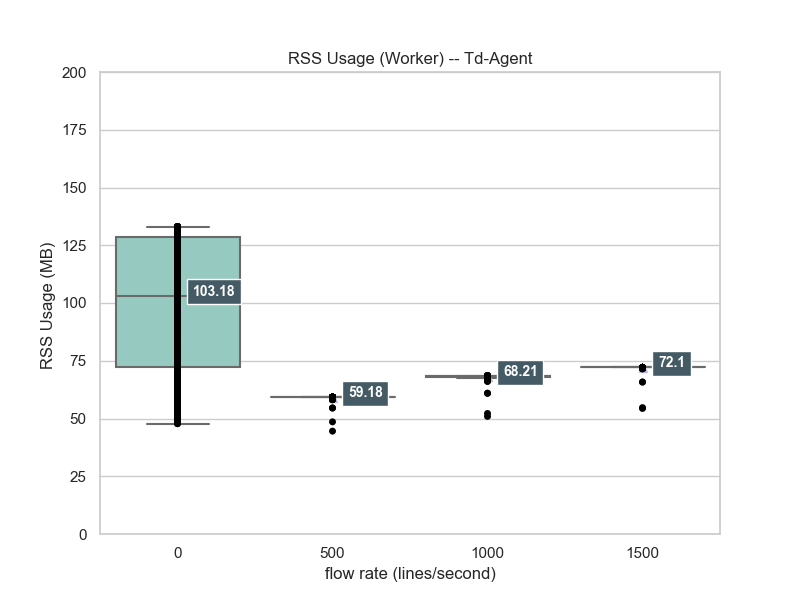

RSS usage of Fluentd worker weakly corresponds to flow rate.
This plot uses actual values of RSS.
baseline RSS usage is a bit of strange....

#### VMS usage -- Supervisor

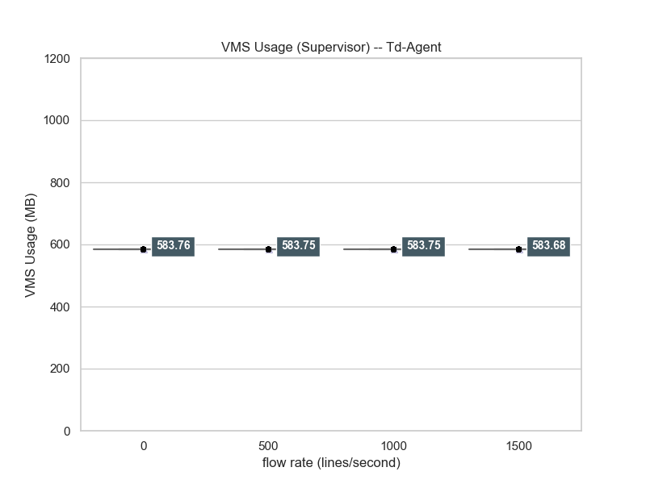

VMS usage of Fluentd supervisor is almost same.
This plot uses actual values of VMS.

#### VMS usage -- Worker

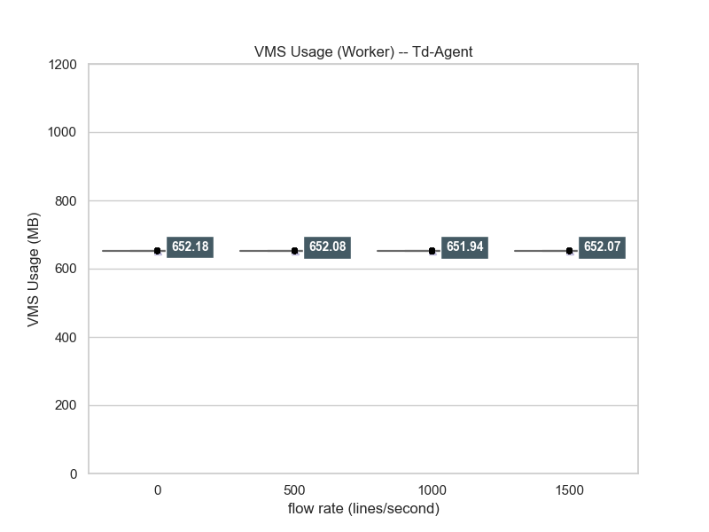

VMS usage of Fluentd supervisor is almost same.
This plot uses actual values of VMS.

### Comparision with Lineplot

#### CPU usage -- Supervisor

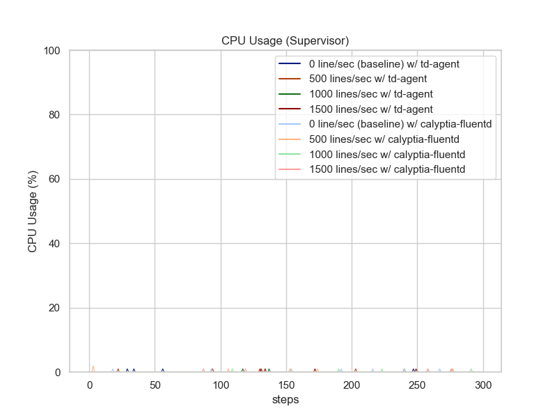

CPU usages on supervisor are almost around zero.

#### CPU usage -- Worker

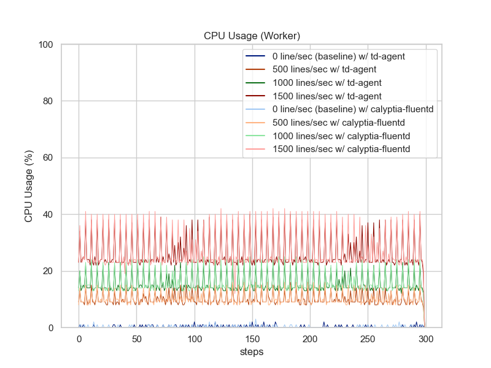

CPU usages on worker almost denote the same tendency.
But, in high traffic ratio environment, Td-Agent uses very slightly bits lower CPU time consumption.

#### RSS usage -- Supervisor

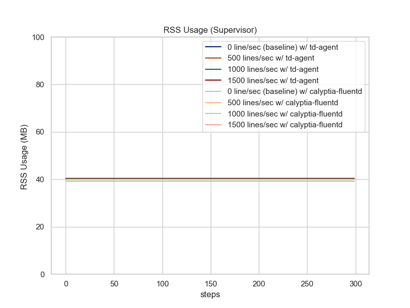

RSS usages on supervisor are almost same in both of agents.

#### RSS usage -- Worker

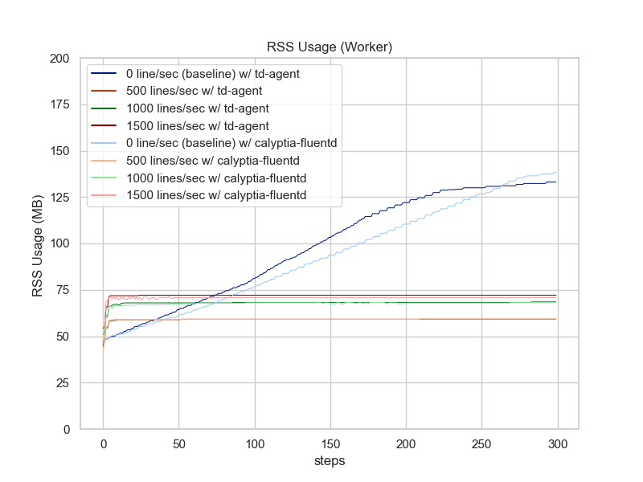

Td-Agent uses more RSS.
When using Calyptia-Fluentd, RSS usage is declined against using Td-Agent with same configuration.
But baseline RSS usages are strange....

#### VMS usage -- Supervisor

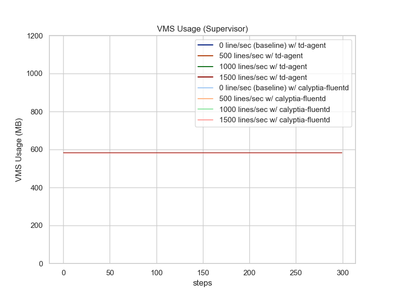

VMS usages on supervisor are almost same in both of agents.

#### VMS usage -- Worker

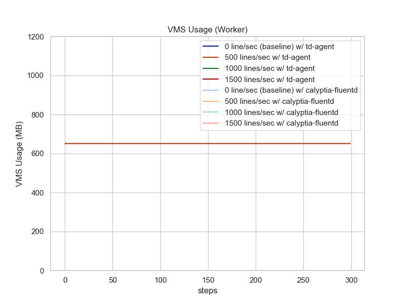

VMS usages on worker denote the same tendency per agents (td-agent vs. calyptia-fluentd).
Td-Agent uses slightly more Working Set.

## Conclusion

* Worker Process
  * `in_syslog` resource usage, which is fixed flow rate, corresponds to:
     * Flow rate
   * Calyptia-Fluentd's CPU usage is almost same, but slightly more consumption CPU usage in high loaded case (ingesting 1500 messages/sec).
   * Calyptia-Fluentd's memory usage is lower than TD-Agent.
* Supervisor process just monitors  life-and-death of worker process(es)
