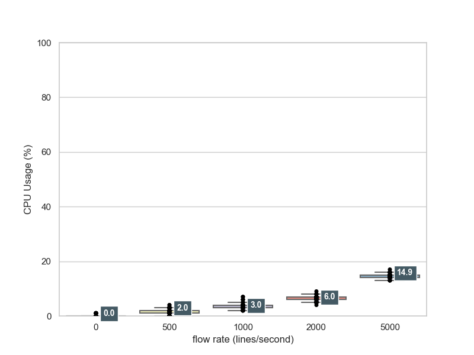
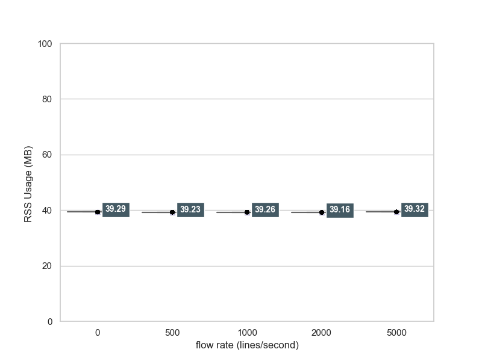
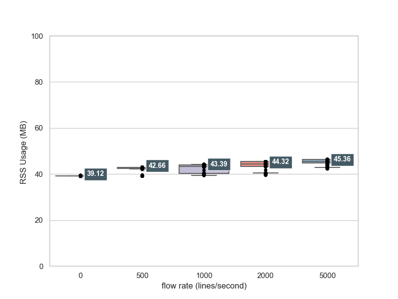
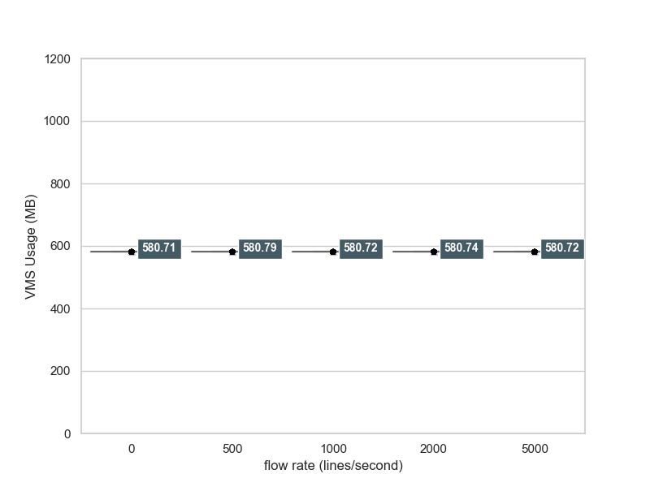
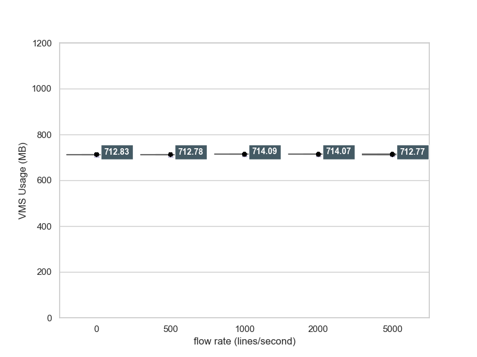

# in_tail benchmark results

## Environment

* Collector
  * CentOS 8 on AWS t2.medium instance
* Aggregator
  * CentOS 8 on AWS t2.medium instance

## Benchmark Scenario

* increase generating lines rate step by step
  * baseline(0 line/sec)
  * 500 lines/sec
  * 1000 lines/sec
  * 2000 lines/sec
  * 5000 lines/sec
* Generate logs with [dummer](https://github.com/sonots/dummer)
* Dummer generates ltsv format lines:
```
# dummer.conf
configure 'sample' do
  output "message.log"
  delimiter "\t"
  labeled true
  field :id, type: :integer, countup: true, format: "%04d"
  field :time, type: :datetime, format: "[%Y-%m-%d %H:%M:%S]", random: false
  field :level, type: :string, any: %w[DEBUG INFO WARN ERROR]
  field :method, type: :string, any: %w[GET POST PUT]
  field :uri, type: :string, any: %w[/api/v1/people /api/v1/textdata]
  field :reqtime, type: :float, range: 0.1..5.0
  field :foobar, type: :string, length: 8
end
```

## Fluentd Configurations for benchmarking

### Collector configuration

```
in_tail ------> out_forword -----> [aggregator node]
```


```aconf
<source>
  @type tail
  @id tail
  tag raw.tail
  path "#{ENV['HOME']}/message.log"
  pos_file "#{ENV['HOME']}/message.log.pos"
  <parse>
    @type ltsv
  </parse>
</source>

<match **>
  @type forward
  <server>
    host 10.1.3.4
    port 24224
  </server>
  <buffer>
    @type file
    flush_interval 2s
    path ./tmp/buffer
  </buffer>
</match>
```

### Aggregator configuration

```
[collector node] ------> in_forword -----> out_stdout
```

```aconf
<source>
  @type forward
</source>
<match **>
  @type stdout
</match>
```

## Results

### CPU usage -- Supervisor


CPU usage of Fluentd supervisor is around zero.

### CPU usage -- Worker



CPU usage of Fluentd worker corresponds to flow rate.
(This plot does not adjust with CPU counts.)

### RSS usage -- Supervisor



RSS usage of Fluentd supervisor is almost same.
This plot uses actual values of RSS.

### RSS usage -- Worker



RSS usage of Fluentd worker weakly corresponds to flow rate.
This plot uses actual values of RSS.

### VMS usage -- Supervisor



VMS usage of Fluentd supervisor is almost same.
This plot uses actual values of VMS.

### VMS usage -- Worker



VMS usage of Fluentd supervisor is almost same.
This plot uses actual values of VMS.

## Conclusion

* Worker Process
  * `in_tail` resource usage for flat file, which steadily growing with fixed flow rate, corresponds to:
     * Flow rate
* Supervisor process just monitors  life-and-death of worker process(es)
