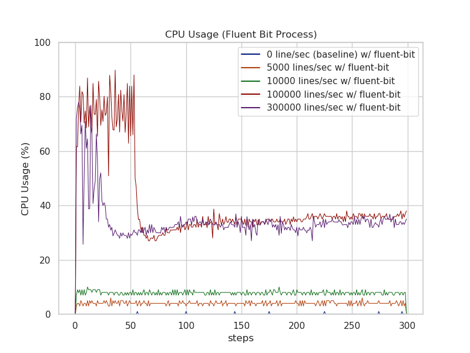
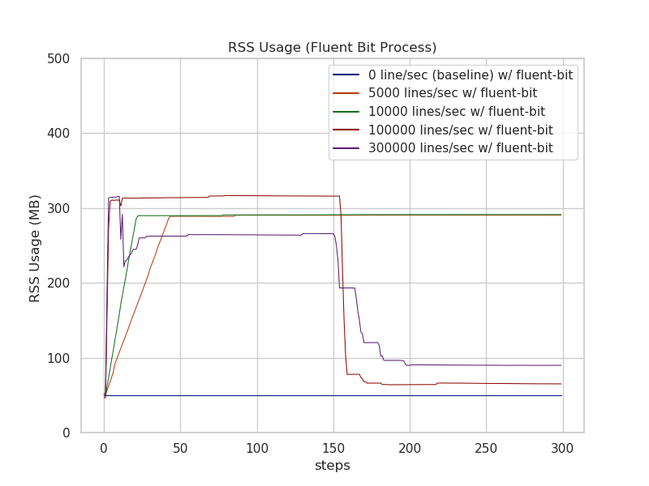
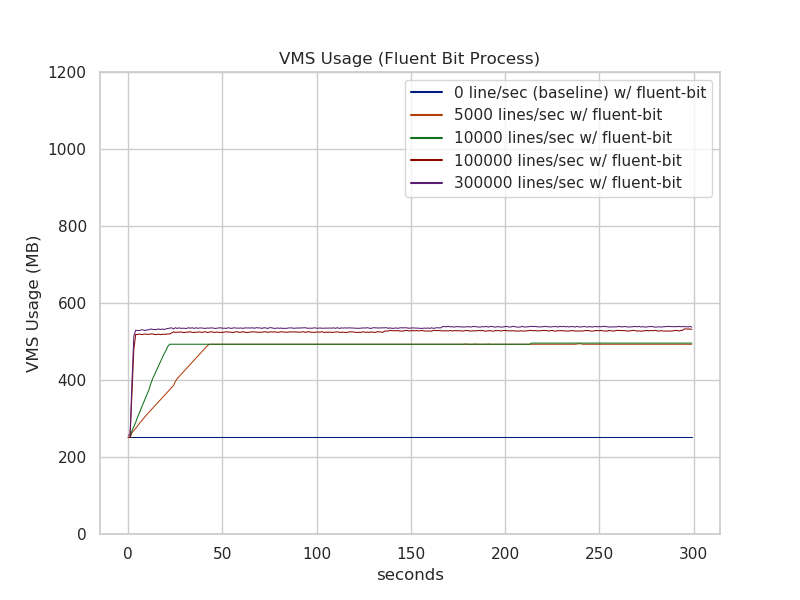
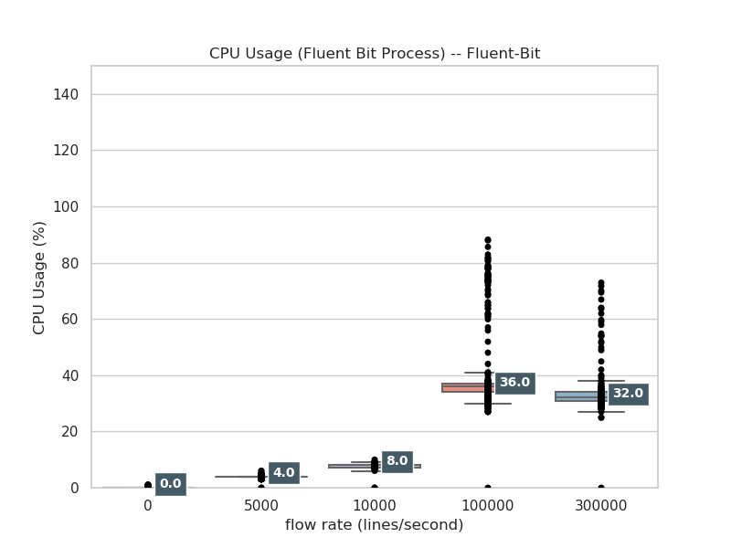
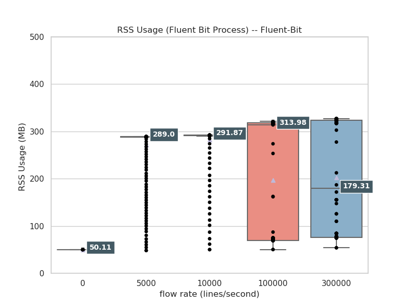
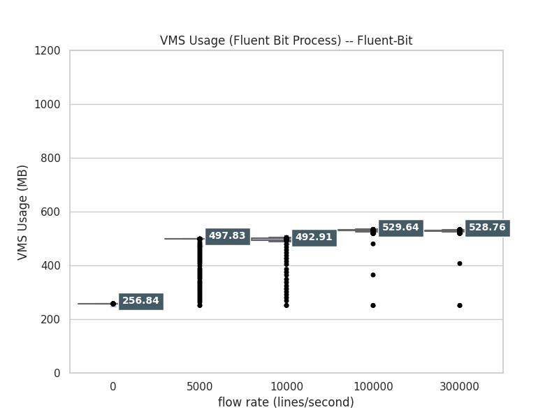

# in_tail benchmark results with Fluent Bit

## Environment

* Collector
  * Rocky Linux 8 on AWS _i3en.large_ instance with gp3 SSD EBS volume that is mounted on `/data`.
  * Fluent Bit v1.8.12
* Aggregator
  * Rocky Linux 8 on AWS _i3en.large_ instance

## Benchmark Scenario

* increase generating lines rate step by step
  * baseline(0 line/sec)
  * 5000 lines/sec
  * 10000 lines/sec
  * 100000 lines/sec
  * 300000 lines/sec
* Generate logs with `run_log_generator.py` which is taken from https://github.com/calyptia/fluent-bit-ci/blob/main/scripts/run_log_generator.py

## Fluent Bit Configurations for benchmarking

### Collector configuration

```
in_tail ------> out_http -----> [aggregator node]
```


```ini
[SERVICE]
	Daemon Off
	Log_Level debug
	Log_file  ${HOME}/fluent-bit.log
	HTTP_Server On
	HTTP_Listen 0.0.0.0
	HTTP_Port 2020
	flush        1
	HTTP_Server  On
	HTTP_Listen  0.0.0.0
	HTTP_PORT    2020
	storage.metrics           on
	storage.path              /data/
	storage.sync              normal
	storage.checksum          off
	storage.backlog.mem_limit 1G
	storage.max_chunks_up     128
	#coro_stack_size   102400000

[INPUT]
	Name                tail
	Path                /data/test.log
	storage.type        filesystem
	Buffer_Chunk_Size   32000
	Buffer_Max_Size     32000

[OUTPUT]
	Name        http
	Alias       output_main
	Match       *
	host        10.1.4.4
	port        8443
	TLS         on
	TLS.verify  off
	workers     10
```

### Aggregator configuration

Received HTTP requests with https-benchmark-server (included binary tarball).

### Results -- Lineplot

#### CPU usage



CPU usages correspond to flow rate.
300000 lines / sec seems to be saturated for processing?

#### RSS usage



RSS usages correspond to flow rate.
300000 lines / sec seems to be saturated for processing?

#### VMS usage



CPU usages correspond to flow rate.
300000 lines / sec seems to be saturated for processing?

## Conclusion

* Fluent Bit Process
  * `in_tail` resource usage for flat file, which steadily growing with fixed flow rate, corresponds to:
     * Flow rate
   * Fluent Bit's CPU usage is corresponding to flow rate, but slightly reduced CPU usage in high loaded case (tailing 300000 lines/sec). This might be indicated that 300000 lines / sec case is saturated for processing.
   * Fluent Bit's memory foot print is almost lower than 300MB event if highly loaded case. Median of memory usage is around 100 MB.


### Appendix

Reading tendency of resource usages from Line plot is a bit of hard. Using box plot makes easier to comprehension about them.
Within a box, resource usage is from 25 percentile to 75 percentile.

## Results -- Boxplots

### fluent-bit

#### CPU usage



CPU usage of fluent-bit process corresponds to flow rate.
300000 lines / sec seems to be saturated for processing?
(This plot does not adjust with CPU counts.)

#### RSS usage



RSS usage of fluent-bit supervisor is almost same.
This plot uses actual values of RSS.

#### VMS usage



This plot uses actual values of VMS.
