# in_windows_eventlog2 benchmark results

## Environment

* Collector
  * Windows Server 2019 on AWS t2.medium instance
  * [Benchmark tool](https://github.com/fluent-plugins-nursery/EventLogBencher) written in C#
* Aggregator
  * CentOS 8 on AWS t2.medium instance

## Benchmark Scenario

* increase generating Windows events size step by step
  * 512 bytes 120000 events total
  * 1024 bytes 120000 events total
  * 2048 bytes 120000 events total
* monitoring Ruby processes with [typeperf](https://docs.microsoft.com/en-us/windows-server/administration/windows-commands/typeperf) during about 18 minutes

## Benchmark PowerShell script

```powershell
Param(
    [string]$workdir = "C:\tools",
    [parameter(mandatory=$true)][int32]$Length,
    [int32]$Total = 120000,
    [string]$PackageName = "calyptia-fluentd"
)

$ENV:PATH="C:\opt\" + $PackageName + "\bin;" + $ENV:PATH

cd $workdir

# Stop Fluentd service if exists
$count = (Get-Service -Name fluentdwinsvc -ErrorAction SilentlyContinue).Count
if ($count -ge 1) {
    Get-Service -Name fluentdwinsvc -ErrorAction SilentlyContinue | Stop-Service
    while ($true) {
	$count = (Get-Process -Name ruby -ErrorAction SilentlyContinue).Count
	if ($count -eq 0) {
            break
	}
	Start-Sleep 1
    }
}

Start-Process fluentd -ArgumentList "-c", "C:\opt\$PackageName\fluent-collector.conf", "-o", "C:\opt\$PackageName\message-$PackageName-$Length-bytes.log" -NoNewWindow -PassThru

while ($true) {
    $count = (Get-Process -Name ruby -ErrorAction SilentlyContinue).Count
    if ($count -ge 2) {
        break
    }
    Start-Sleep 1
}

while($true) {
    $instances = (Get-Counter "\Process(*)\% Processor Time" -ErrorAction SilentlyContinue).CounterSamples | select InstanceName | select-string "ruby"
    if ($instances.Count -ge 2) {
        break
    }
    Start-Sleep 1
}

Start-Process typeperf -ArgumentList "-cf", "counters.txt", "-sc", "2400", "-si", "1" -PassThru -RedirectStandardOutput C:\tools\${Length}-${PackageName}-resource-usage.csv

$socket_count_job = Start-Process powershell -ArgumentList "-ExecutionPolicy", "RemoteSigned", C:\tools\socket-count.ps1 -PassThru -NoNewWindow -RedirectStandardOutput C:\tools\${Length}-${PackageName}-socket-usage.csv

Start-Process C:\tools\EventLogBencher\EventLogBencher.exe -ArgumentList "wait", "-w", "50", "-t", "$Total", "-l", "$Length" -Wait -NoNewWindow

Stop-Process -Id $socket_count_job.Id
taskkill /F /IM ruby.exe
taskkill /F /IM typeperf.exe
```

# Fluentd Configurations for benchmarking

### Collector configuration

```
[Writing Windows EventLogs into Benchmark channel] ---> in_windows_eventlog2 ------> out_forword -----> [aggregator node]
```


```aconf
<source>
  @type windows_eventlog2
  @id winevtlog
  tag raw.winevt
  channels ["Benchmark"]
  read_existing_events true
  render_as_xml false
  preserve_qualifiers_on_hash true
  <storage>
    @type local
    persistent true
    path ./tmp/storage.json
  </storage>
</source>

<match **>
  @type forward
  <server>
    host 10.0.2.4
    port 24224
  </server>
  <buffer>
    @type file_single
    flush_interval 2s
    path ./tmp/buffer
  </buffer>
</match>
```

### Aggregator configuration

```
[collector node] ------> in_forword -----> out_stdout
```

```aconf
<source>
  @type forward
</source>
<match **>
  @type stdout
</match>
```

## Results -- Bloxplots

### Calyptia-Fluentd

#### CPU usage -- Supervisor

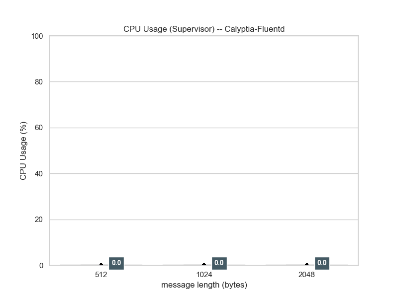

CPU usage of Fluentd supervisor is around zero.

#### CPU usage -- Worker

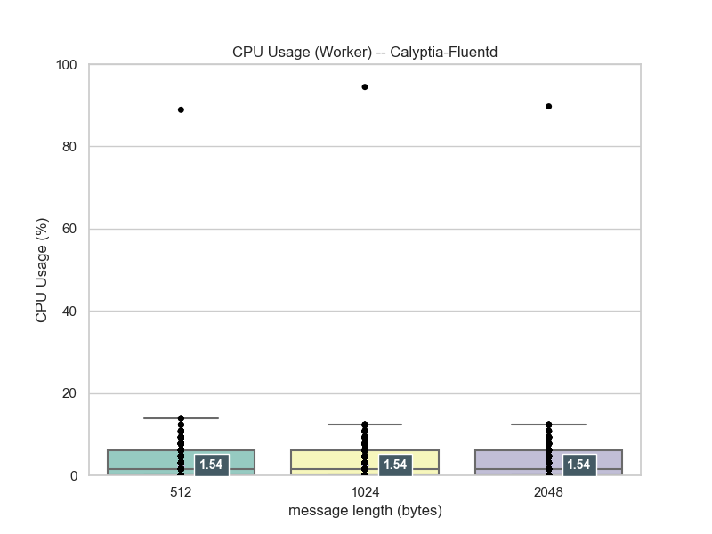

CPU usage of Fluentd worker weakly corresponds to flow rate.
(This plot does not adjust with CPU counts.)

#### Working Set usage -- Supervisor

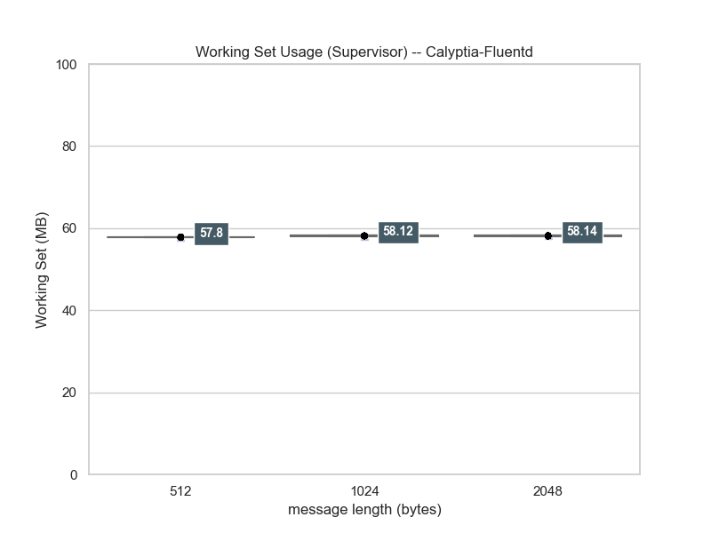

Working Set usage of Fluentd supervisor is almost same.
This plot uses actual values of RSS.

#### Working Set usage -- Worker

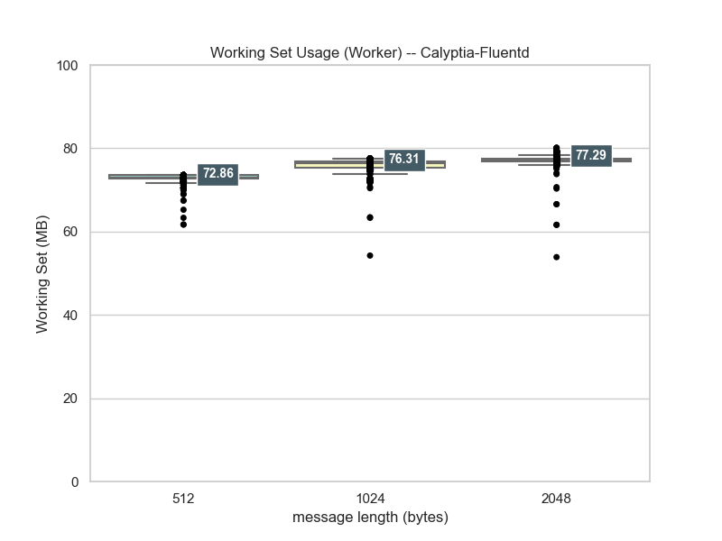

Working Set usage of Fluentd worker corresponds to flow rate.
This plot uses actual values of Working Set.

#### Private Bytes usage -- Supervisor

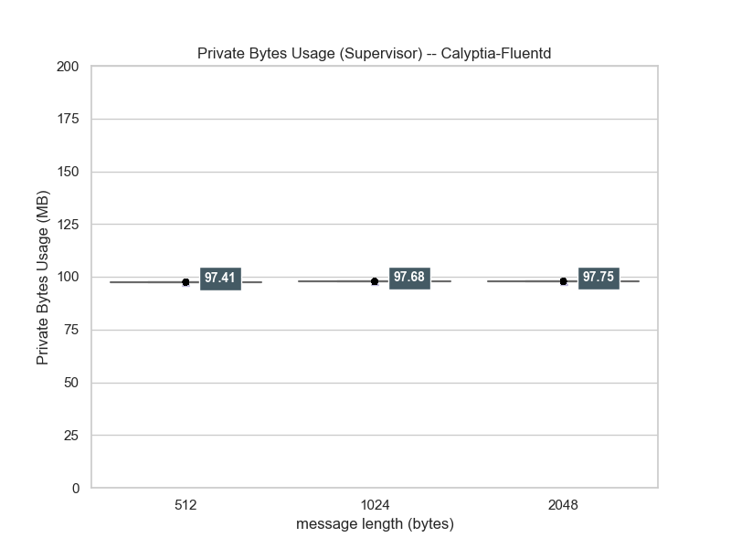

Private Bytes usage of Fluentd supervisor is almost same.
This plot uses actual values of Private Bytes.

#### Private Bytes usage -- Worker

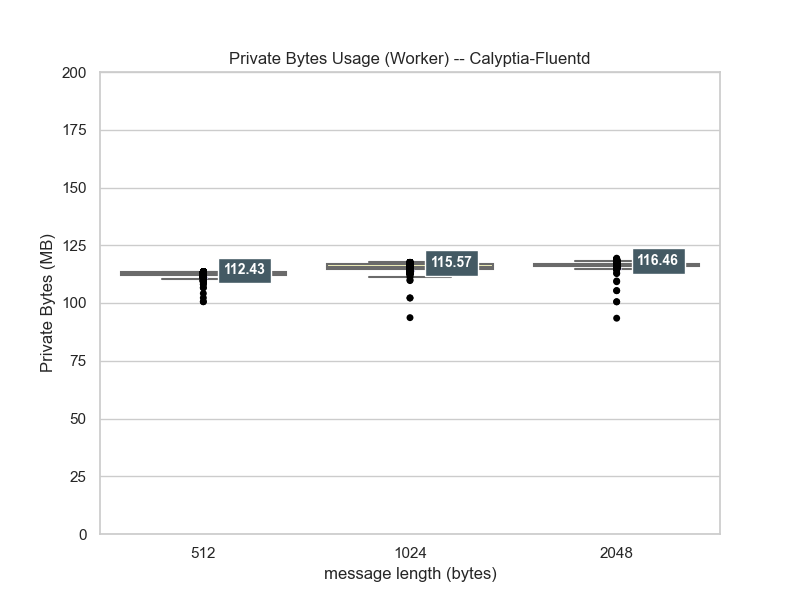

Private Bytes usage of Fluentd supervisor is almost same.
This plot uses actual values of Private Bytes.

### Td-Agent

#### CPU usage -- Supervisor

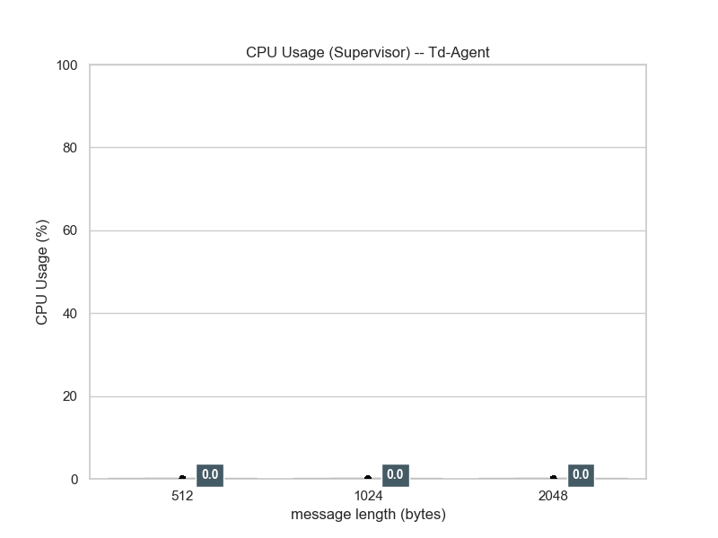

CPU usage of Fluentd supervisor is around zero.

#### CPU usage -- Worker

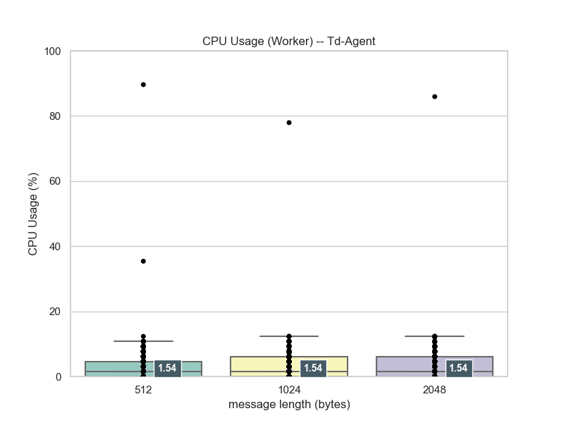

CPU usage of Fluentd worker weakly corresponds to flow rate.
(This plot does not adjust with CPU counts.)

#### Working Set usage -- Supervisor

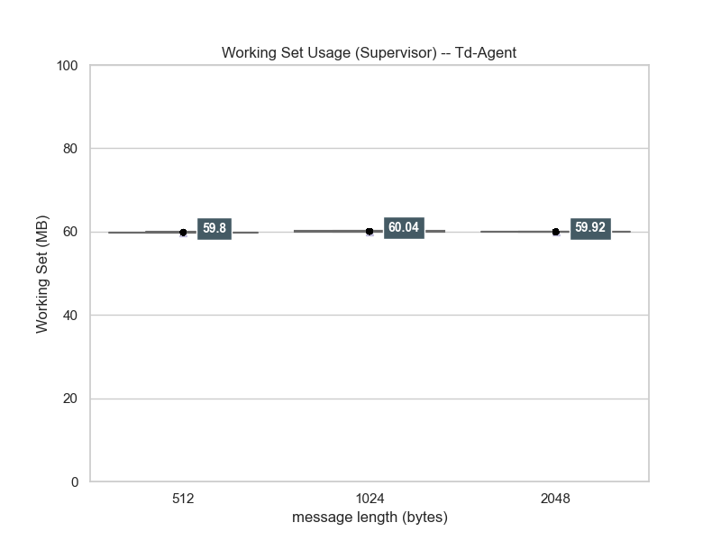

Working Set usage of Fluentd supervisor is almost same.
This plot uses actual values of RSS.

#### Working Set usage -- Worker

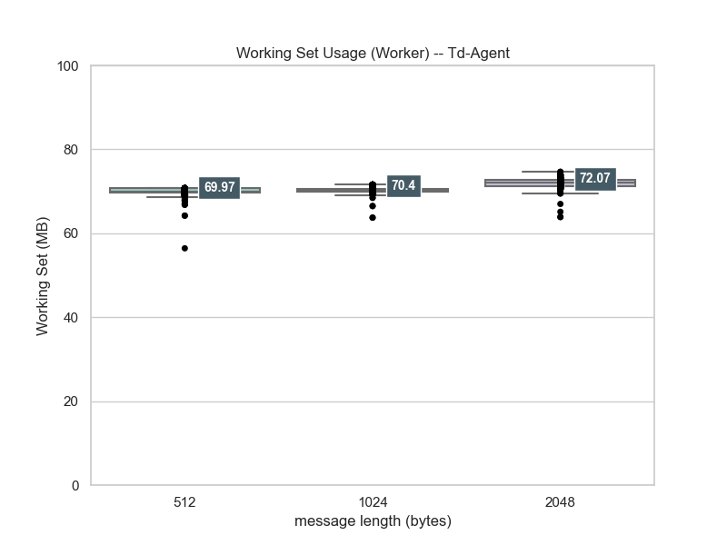

Working Set usage of Fluentd worker corresponds to flow rate.
This plot uses actual values of Working Set.

#### Private Bytes usage -- Supervisor

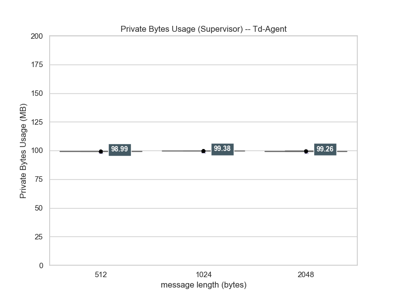

Private Bytes usage of Fluentd supervisor is almost same.
This plot uses actual values of Private Bytes.

#### Private Bytes usage -- Worker

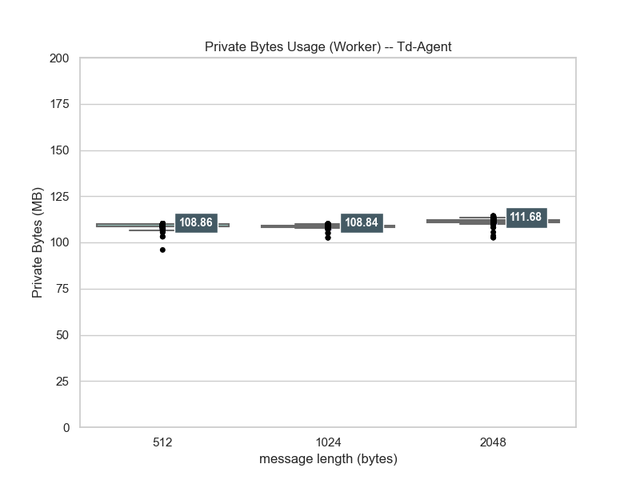

Private Bytes usage of Fluentd supervisor is almost same.
This plot uses actual values of Private Bytes.

### Comparision with Lineplot

#### CPU usage -- Supervisor


CPU usages on supervisor are almost around zero.

#### CPU usage -- Worker


CPU usages on worker denote the same tendency. As described before section, the distribution is same. So, we cannot observe performance improvements on `in_windows_eventlog2` scenario.

#### Working Set usage -- Supervisor

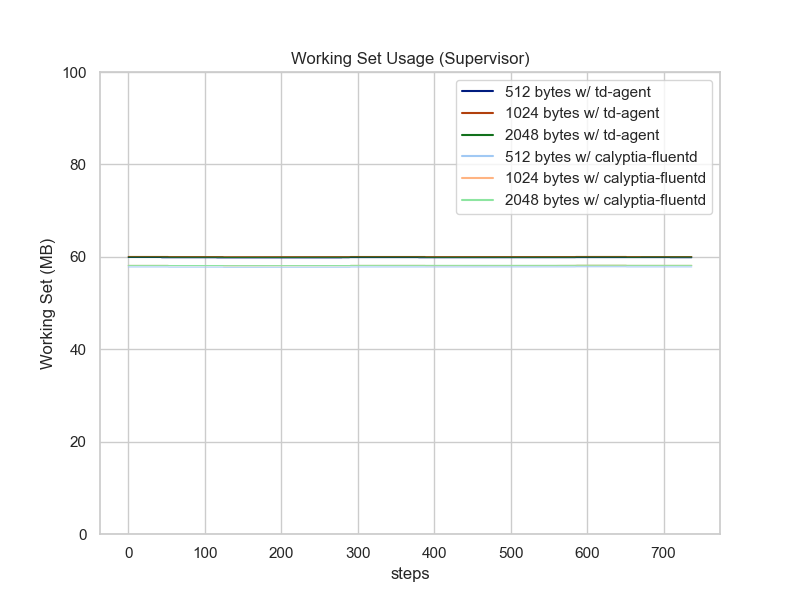

Working Set usages on supervisor are almost same in both of agents.

#### Working Set usage -- Worker

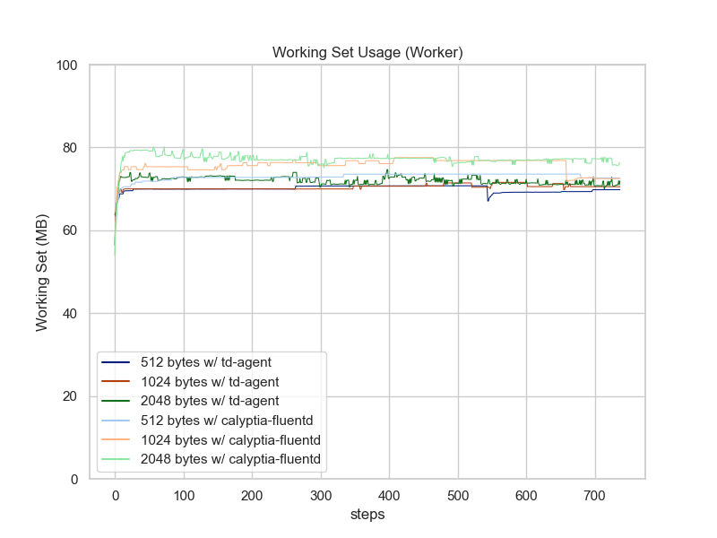

Working Set usages on worker denote the same tendency per agents (td-agent vs. calyptia-fluentd).
Calyptia-Fluentd uses slightly more Working Set.

#### Private Bytes usage -- Supervisor

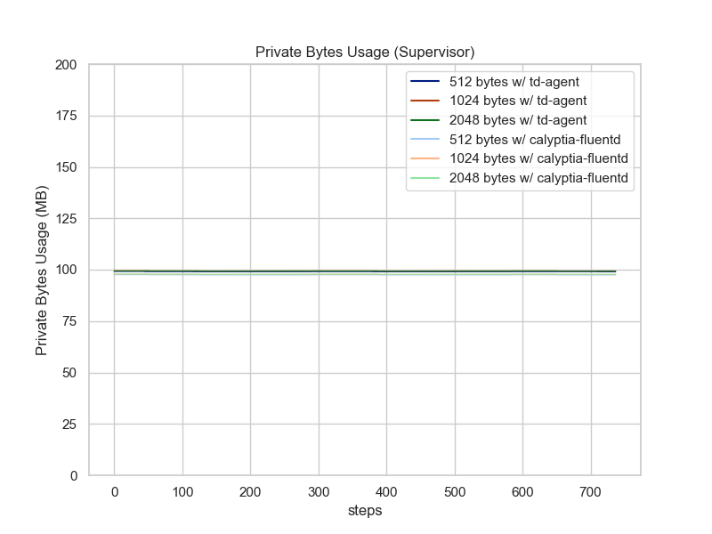

Private Bytes usages on supervisor are almost same in both of agents.

#### Private Bytes Set usage -- Worker

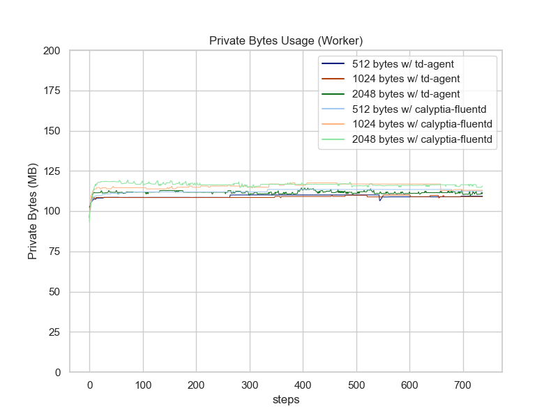

Working Set usages on worker denote the same tendency per agents (td-agent vs. calyptia-fluentd).
Calyptia-Fluentd uses slightly more Working Set.

## Conclusion

* Worker Process
  * `in_windows_eventlog2` resource usage for flat file, which steadily growing with fixed flow rate, corresponds to:
     * Flow rate
     * CPU Usage is almost same between Calyptia-Fluentd and Td-Agent
        * Because `in_windows_eventlog2` plugin handles almost all Windows EventLog processing on its dependent gem `winevt_c` and the dependent gem is writte in C extension. That's why upgrading Ruby does not reduce CPU usage.
     * Calyptia-Fluentd's memory usage is a bit of slightly higher than TD-Agent.
* Supervisor process just monitors  life-and-death of worker process(es)
